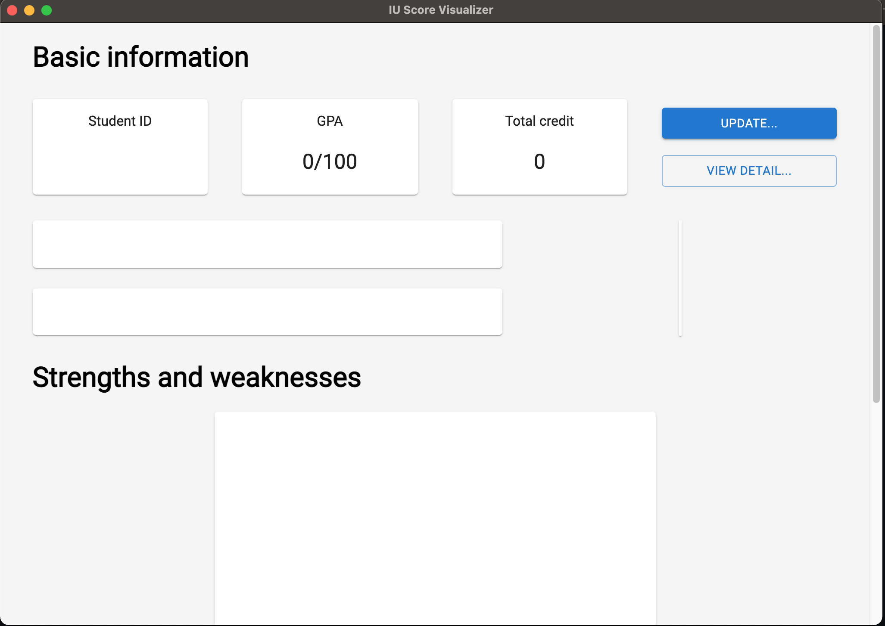
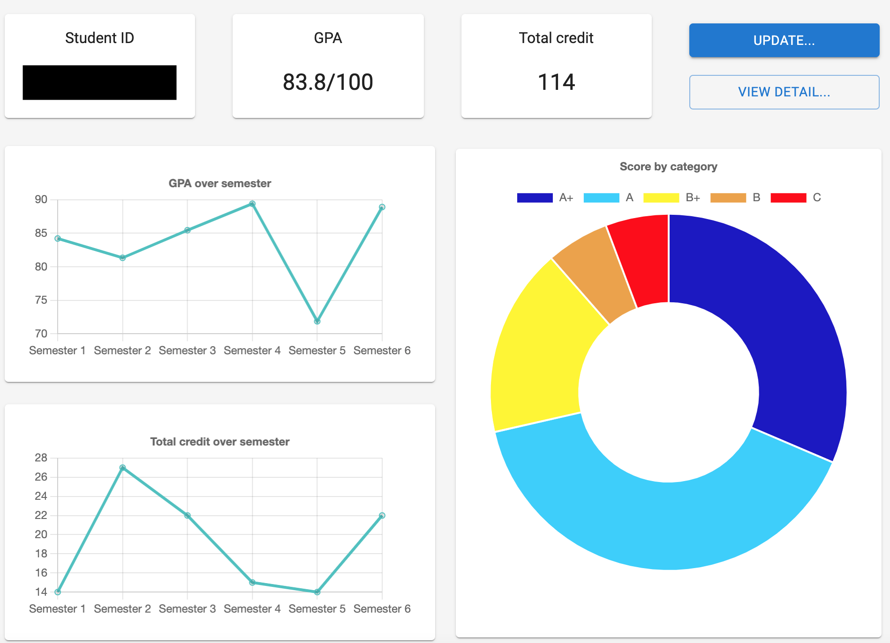
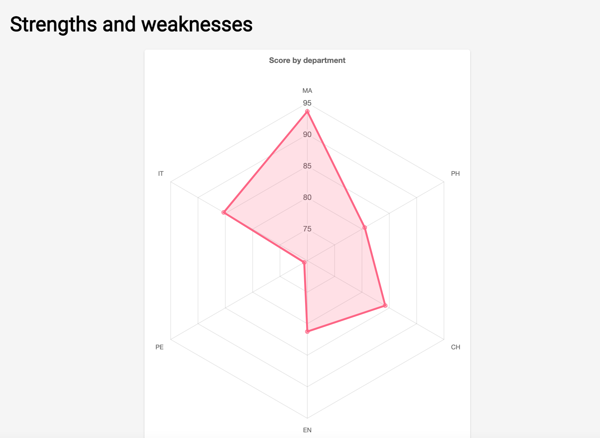

# IU Score Visualizer

## Motivation

To the extent of my knowledge, in Vietnam, Junior Data Analysts usually has to make dashboard to keep track of some key metrics. As a result, I want to make a side project on visualizing transcript of a student to keep track of his or her performance. Hence, this project is made.

## Installation

Please download the version compatible to your OS [here](https://github.com/minhrongcon2000/IU-Score-visualizer/releases/tag/v2.1).

## Overview

When the application is first installed, the UI would resemble the following figure:

Since this app is designed only for students studying in International University, VNU-HCMC, account should be provided to see full visualization. This can be done by clicking `Update` button on the top right of the screen, which revealed a window that asks for username and password. Please provide the password that can be usable [here](http://edusoftweb.hcmiu.edu.vn). _Note_: this application does NOT hold any information regarding to student's sensitive information. These information is sent directly to the university website and is not intercept by any internal mechanism. The code for data collection is open-sourced in `src/main/main.ts` (the first 175 lines).

Once the user is logged in, the full UI would resemble the following illustrations. The information on student ID is hidden for the purpose of security and privacy.

There are two figures representing two sections of the dashboard. The first section is about basic information on the overall score, the number of credit, and the overall progress. This section only takes into account semester that a student has finished and shows accomplished achievement. The second section is strengths and weaknesses, where students can evaluate what subjects they are good at and what subjects they need to be improved. Each vertex in the second section represents a group of related subject. For instance, in the lower chart, MA means mathematical-related subjects and IT means IT-related subject.

## Future improvements

- Mobile application
- More complex visualization (your opinion will heavily affect what visualization will be available next, so stay tune!)

## Tools use

Framework: [electron-react-boilerplate](https://electron-react-boilerplate.js.org)

UI: [Material UI](https://mui.com)

Data collection libraries: [cross-fetch](https://www.npmjs.com/package/cross-fetch)
